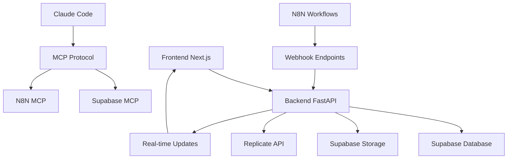

# Proyecto: [NOMBRE_DEL_PROYECTO]

## 🎯 Principios de Desarrollo (Context Engineering)

### Design Philosophy
- **KISS**: Keep It Simple, Stupid - Prefiere soluciones simples
- **YAGNI**: You Aren't Gonna Need It - Implementa solo lo necesario  
- **DRY**: Don't Repeat Yourself - Evita duplicación de código
- **SOLID**: Single Responsibility, Open/Closed, Liskov Substitution, Interface Segregation, Dependency Inversion

  🎨 FILOSOFÍA DE DESARROLLO:

  "Build what you need, when you need it" - No over-engineering, no feature creep. Perfecto.
  "Leverage existing work"

## 🏗️ Tech Stack & Architecture

### Core Stack
- **Frontend**: [Next.js/React + TypeScript]
- **Backend**: [FastAPI/Python + SQLModel]
- **Base de Datos**: [PostgreSQL/Supabase]
- **Styling**: [Tailwind CSS/Styled Components]
- **Testing**: [Jest + pytest]

### Hybrid Strategic Architecture

**Enfoque: Arquitectura Híbrida Estratégica optimizada para desarrollo asistido por IA**

- **Frontend**: Feature-First Architecture
- **Backend**: Clean Architecture (Layered)
- **Principio**: Cada parte usa la estructura que mejor se adapta a su contexto

#### Frontend: Feature-First
```
frontend/
├── src/
│   ├── app/              # Next.js routes, layout global
│   │   ├── (auth)/       # Rutas de autenticación
│   │   ├── layout.tsx    # Layout principal
│   │   └── page.tsx      # Página principal
│   ├── features/         # 🎯 Organizadas por funcionalidad
│   │   ├── [feature]/    # Ej: auth, dashboard, chat
│   │   │   ├── components/ # Componentes específicos
│   │   │   ├── hooks/      # Custom hooks
│   │   │   ├── services/   # API calls
│   │   │   └── types/      # Tipos específicos
│   │   └── ...
│   └── shared/           # Código reutilizable
│       ├── components/   # UI components genéricos
│       ├── hooks/        # Hooks genéricos
│       ├── stores/       # Estado global (Zustand)
│       ├── types/        # Tipos compartidos
│       ├── utils/        # Utilidades
│       └── lib/          # Configuraciones (Supabase, etc.)
```

#### Backend: Clean Architecture
```
backend/
├── main.py               # Punto de entrada FastAPI
├── api/                  # 🌐 Capa de Interfaz/Presentación
│   ├── auth_deps.py      # Dependencias de autenticación
│   ├── [feature]_router.py # Endpoints por feature
│   └── ...
├── application/          # 🎯 Casos de Uso/Orquestación
│   └── services/         # Servicios de aplicación
│       └── [feature]_service.py
├── domain/              # 💎 Lógica de Negocio Pura
│   ├── models/          # Entidades (SQLModel)
│   ├── services/        # Servicios de dominio
│   ├── config/          # Configuración de dominio
│   └── interfaces/      # Abstracciones/Contratos
└── infrastructure/      # 🔧 Implementaciones Externas
    ├── persistence/     # Repositorios, DB access
    ├── external_apis/   # Clientes APIs externas
    └── config/          # Configuración de infraestructura
```

### Arquitectura Completa
```
proyecto/
├── frontend/            # Feature-First Architecture
├── backend/            # Clean Architecture  
├── supabase/          # Migraciones de BD
│   └── migrations/
├── .claude/           # Configuración Claude Code
└── docs/             # Documentación técnica
```

> **🤖 ¿Por qué esta arquitectura?**
> 
> Esta estructura híbrida fue diseñada específicamente para **desarrollo asistido por IA**. La organización clara por capas y features permite que los AI assistants:
> - **Localicen rápidamente** el código relacionado con una funcionalidad específica
> - **Entiendan el contexto** sin necesidad de navegar múltiples archivos dispersos  
> - **Mantengan la separación de responsabilidades** al generar código nuevo
> - **Escalen el proyecto** añadiendo features sin afectar el código existente
> - **Generen código consistente** siguiendo los patrones establecidos en cada capa
>
> *La IA puede trabajar de forma más efectiva cuando la información está organizada siguiendo principios claros y predecibles.*

## 🛠️ Comandos Importantes

### Development
- `npm run dev` - Servidor de desarrollo (puerto 3000 por defecto)
- `npm run build` - Build para producción
- `npm run preview` - Preview del build
- `uvicorn main:app --reload` - Backend Python (puerto 8000 por defecto)

### 🚨 CONFIGURACIÓN DE PUERTOS (SYSTEM PROMPT)
**FRONTEND DEFAULT: localhost:3000**
**BACKEND DEFAULT: localhost:8000**
- Backend siempre debe apuntar a FRONTEND_URL = "http://localhost:3000"
- Esta configuración es crítica para tool calling chat → replicate

### Quality Assurance
- `npm run test` - Ejecutar tests
- `npm run test:watch` - Tests en modo watch
- `npm run test:coverage` - Coverage report
- `npm run lint` - ESLint
- `npm run lint:fix` - Fix automático de linting
- `npm run typecheck` - Verificación de tipos TypeScript

### Git Workflow
- `npm run commit` - Commit con Conventional Commits
- `npm run pre-commit` - Hook de pre-commit

## 📝 Convenciones de Código

### File & Function Limits
- **Archivos**: Máximo 500 líneas
- **Funciones**: Máximo 50 líneas
- **Componentes**: Una responsabilidad clara

### Naming Conventions
- **Variables/Functions**: `camelCase`
- **Components**: `PascalCase`
- **Constants**: `UPPER_SNAKE_CASE`
- **Files**: `kebab-case.extension`
- **Folders**: `kebab-case`

### TypeScript Guidelines
- **Siempre usar type hints** para function signatures
- **Interfaces** para object shapes
- **Types** para unions y primitives
- **Evitar `any`** - usar `unknown` si es necesario

### Component Patterns
```typescript
// ✅ GOOD: Proper component structure
interface Props {
  children: React.ReactNode;
  variant?: 'primary' | 'secondary';
  onClick: () => void;
}

export function Button({ children, variant = 'primary', onClick }: Props) {
  return (
    <button 
      onClick={onClick}
      className={`btn btn-${variant}`}
    >
      {children}
    </button>
  );
}
```

## 🧪 Testing Strategy

### Test-Driven Development (TDD)
1. **Red**: Escribe el test que falla
2. **Green**: Implementa código mínimo para pasar
3. **Refactor**: Mejora el código manteniendo tests verdes

### Test Structure (AAA Pattern)
```typescript
// ✅ GOOD: Clear test structure
test('should calculate total with tax', () => {
  // Arrange
  const items = [{ price: 100 }, { price: 200 }];
  const taxRate = 0.1;
  
  // Act
  const result = calculateTotal(items, taxRate);
  
  // Assert  
  expect(result).toBe(330);
});
```

### Coverage Goals
- **Unit Tests**: 80%+ coverage
- **Integration Tests**: Critical paths
- **E2E Tests**: Main user journeys

## 🔒 Security Best Practices

### Input Validation
- Validate all user inputs
- Sanitize data before processing
- Use schema validation (Zod, Yup, etc.)

### Authentication & Authorization
- JWT tokens con expiración
- Role-based access control
- Secure session management

### Data Protection
- Never log sensitive data
- Encrypt data at rest
- Use HTTPS everywhere

## ⚡ Performance Guidelines

### Code Splitting
- Route-based splitting
- Component lazy loading
- Dynamic imports

### State Management
- Local state first
- Global state only when needed
- Memoization for expensive computations

### Database Optimization
- Index frequently queried columns
- Use pagination for large datasets
- Cache repeated queries

## 🔄 Git Workflow & Repository Rules

### Branch Strategy
- `main` - Production ready code
- `develop` - Integration branch
- `feature/TICKET-123-description` - Feature branches
- `hotfix/TICKET-456-description` - Hotfixes

### Commit Convention (Conventional Commits)
```
type(scope): description

feat(auth): add OAuth2 integration
fix(api): handle null user response  
docs(readme): update installation steps
```

### Pull Request Rules
- **No direct commits** a `main` o `develop`
- **Require PR review** antes de merge
- **All tests must pass** antes de merge
- **Squash and merge** para mantener historia limpia

## ❌ No Hacer (Critical)

### Code Quality
- ❌ No usar `any` en TypeScript
- ❌ No hacer commits sin tests
- ❌ No omitir manejo de errores
- ❌ No hardcodear configuraciones

### Security  
- ❌ No exponer secrets en código
- ❌ No loggear información sensible
- ❌ No saltarse validación de entrada
- ❌ No usar HTTP en producción

### Architecture
- ❌ No editar archivos en `src/legacy/`
- ❌ No crear dependencias circulares
- ❌ No mezclar concerns en un componente
- ❌ No usar global state innecesariamente


## 🤖 AI Assistant Guidelines

### When Suggesting Code
- Siempre incluir types en TypeScript
- Seguir principles de CLAUDE.md
- Implementar error handling
- Incluir tests cuando sea relevante

### When Reviewing Code  
- Verificar adherencia a principios SOLID
- Validar security best practices
- Sugerir optimizaciones de performance
- Recomendar mejoras en testing

### Context Priority
1. **CLAUDE.md rules** (highest priority)
2. **.claude/docs/** workflows y guías
3. **Project-specific files** (package.json, etc.)
4. **General best practices**

## 🚀 Pre-Development Validation Protocol

### API & Dependencies Current Check
**CRÍTICO**: Siempre verificar antes de asumir
- [ ] ✅ Verificar que las versiones de APIs/modelos existen (ej: GPT-5 no existe aún)
- [ ] ✅ Confirmar que las librerías están actualizadas
- [ ] ✅ Validar endpoints externos funcionan
- [ ] ✅ Tener fallbacks para todas las dependencias externas

### Simplicity-First Development
- [ ] ✅ Crear versión simplificada primero (`simple_main.py`)
- [ ] ✅ Probar funcionalidad básica antes de agregar complejidad
- [ ] ✅ Mantener siempre una versión "modo demo" que funcione
- [ ] ✅ Implementar mock data para casos donde servicios externos fallen

### Incremental Validation Strategy
- [ ] ✅ Probar cada endpoint inmediatamente después de crearlo
- [ ] ✅ Usar TodoWrite para tracking sistemático de progreso
- [ ] ✅ Validar UI después de cada cambio importante
- [ ] ✅ Mantener logs detallados de errores para debugging

## 🔄 Error-First Development Protocol

### Manejo de Errores Predictivos
```python
# ✅ GOOD: Siempre incluir fallbacks
try:
    ai_result = await openai_call()
except Exception as e:
    print(f"AI call failed: {e}")
    ai_result = get_mock_fallback()  # Siempre tener fallback
```

### Debugging Sin Visibilidad Directa
- **Usar logs extensivos** con emojis para fácil identificación
- **Crear endpoints de testing** (`/test-connection`, `/health`)  
- **Implementar timeouts** en todas las llamadas externas
- **Hacer requests incrementales** - nunca asumir que algo complejo funcionará

## 🎯 Advanced Real-Time Debugging (Expert Level)

### Background Log Streaming Setup
```bash
# 1. Start dev servers with log capture
npm run dev 2>&1 | tee frontend.log
uvicorn main:app --reload 2>&1 | tee backend.log

# 2. Monitor logs in real-time (Claude Code)
tail -f frontend.log | claude -p "Alert me of compilation errors"

# 3. Use Background Commands (Ctrl+B)
npm run dev  # Press Ctrl+B to run in background
# Then use BashOutput tool to monitor status
```

### Claude Code Web Interface
```bash
# Install web interface for visual log monitoring
npm install -g claude-code-web
claude-code-web --debug  # Enhanced logging mode

# Or use alternative: 
npx claude-code-web --dev  # Development mode with verbose logs
```

### Multi-Terminal Monitoring Pattern
```bash
# Terminal 1: Backend with structured logging
python -m uvicorn main:app --reload --log-level debug

# Terminal 2: Frontend with compilation monitoring
npm run dev -- --verbose

# Terminal 3: Claude Code with combined log analysis
tail -f *.log | claude -p "Debug any compilation or runtime errors immediately"
```

### Background Task Management
- **Use Ctrl+B** para run commands in background
- **BashOutput tool** para retrieving incremental output
- **Filter logs** for specific patterns (ERROR, WARN, Compil)
- **Status tracking** (running/completed/killed)

## 🎨 Bucle Agéntico con Playwright MCP

### Metodología de Desarrollo Visual
**Problema:** IA genera frontends genéricos sin poder ver el resultado  
**Solución:** Playwright MCP otorga "ojos" al AI para iteración visual

### Bucle Agéntico Frontend
```
1. Código UI → 2. Playwright Screenshot → 3. Visual Compare → 4. Iterate
```

### Playwright MCP Integration
- **browser_snapshot**: Captura estado actual de la página
- **browser_take_screenshot**: Screenshots para comparación visual
- **browser_navigate**: Navegación automática para testing
- **browser_click/type**: Interacción automatizada con UI
- **browser_resize**: Testing responsive en diferentes viewports

### Visual Development Protocol
1. **Implementar componente** siguiendo specs
2. **Capturar screenshot** con Playwright
3. **Comparar vs design requirements**
4. **Iterar automáticamente** hasta pixel-perfect
5. **Validar responsiveness** en mobile/tablet/desktop

### Integration con Design Review
- Activar review visual automático post-implementación
- Usar criterios objetivos de diseño (spacing, colors, typography)
- Generar feedback específico y accionable
- Prevenir frontends genéricos mediante validación visual

---

## 🚀 Integraciones y Herramientas Externas

### 🤖 N8N Workflow Integration

**Propósito:** Automatizar workflows completos de generación de imágenes

#### Configuración N8N
- **Backend Integration:** `/api/webhooks/n8n/` endpoints para recibir triggers
- **Workflow Típico:** Trigger → Generate Images → Filter Results → Store → Notify
- **Authentication:** API Key validation para seguridad

#### Endpoints para N8N
```python
# backend/api/n8n_router.py
@router.post("/webhooks/n8n/generate")
async def n8n_generate_batch(request: N8NGenerateRequest):
    # Procesa request de N8N
    # Genera imágenes en batch
    # Retorna resultados filtrados
```

#### Variables de Entorno N8N
```bash
N8N_WEBHOOK_URL=your_n8n_webhook_url_here
N8N_API_KEY=your_n8n_api_key_here
```

### 🗄️ Supabase Integration

**Propósito:** Base de datos, autenticación y almacenamiento escalable

#### Configuración Supabase
- **Database:** PostgreSQL para metadatos y configuraciones
- **Auth:** Sistema de usuarios completo con JWT
- **Storage:** Bucket para imágenes generadas con CDN
- **Real-time:** Subscripciones para updates en tiempo real

#### Modelos de Datos
```sql
-- Tabla principal de generaciones
CREATE TABLE generations (
    id UUID PRIMARY KEY DEFAULT uuid_generate_v4(),
    user_id UUID REFERENCES auth.users(id),
    prompt TEXT NOT NULL,
    model_version VARCHAR(255),
    parameters JSONB,
    status generation_status DEFAULT 'pending',
    created_at TIMESTAMP WITH TIME ZONE DEFAULT NOW(),
    updated_at TIMESTAMP WITH TIME ZONE DEFAULT NOW()
);

-- Tabla de imágenes generadas
CREATE TABLE generated_images (
    id UUID PRIMARY KEY DEFAULT uuid_generate_v4(),
    generation_id UUID REFERENCES generations(id),
    url TEXT NOT NULL,
    metadata JSONB,
    is_favorite BOOLEAN DEFAULT FALSE,
    quality_score FLOAT,
    created_at TIMESTAMP WITH TIME ZONE DEFAULT NOW()
);
```

#### Variables de Entorno Supabase
```bash
SUPABASE_URL=your_supabase_url_here
SUPABASE_ANON_KEY=your_supabase_anon_key_here
SUPABASE_SERVICE_KEY=your_supabase_service_key_here
```

### 🧰 MCP Protocol Integration

**Propósito:** Extender capacidades de Claude Code con herramientas personalizadas

#### Herramientas MCP Configuradas

##### 1. Supabase MCP Tool
```json
{
  "name": "supabase-connector",
  "description": "Conecta directamente con Supabase para queries",
  "capabilities": [
    "database_query",
    "auth_management",
    "storage_operations"
  ]
}
```

##### 2. N8N MCP Tool
```json
{
  "name": "n8n-workflow-trigger",
  "description": "Ejecuta workflows de N8N desde Claude",
  "capabilities": [
    "trigger_workflow",
    "check_status",
    "get_results"
  ]
}
```

##### 3. Image Analysis MCP Tool
```json
{
  "name": "image-quality-analyzer",
  "description": "Analiza calidad y características de imágenes",
  "capabilities": [
    "quality_scoring",
    "face_detection",
    "composition_analysis"
  ]
}
```

#### Configuración MCP
```json
// .mcp.json (en raíz del proyecto)
{
  "mcpServers": {
    "supabase": {
      "type": "http",
      "url": "https://mcp.supabase.com/mcp?project_ref=${SUPABASE_PROJECT_ID}&read_only=true"
    }
  }
}
```
**⚠️ AUTENTICACIÓN CRÍTICA:** El primer acceso a Supabase MCP abre automáticamente un navegador para login OAuth. Selecciona tu organización y autoriza. Claude Code luego tiene acceso a tu proyecto.

### 🔄 Automated Workflow Examples

#### Ejemplo 1: Generación Automática desde N8N
```
Trigger (N8N) → POST /api/webhooks/n8n/generate
↓
Backend procesa request
↓
Genera 10 imágenes con Replicate
↓
Filtra usando IA quality scoring
↓
Guarda en Supabase Storage
↓
Notifica a frontend via WebSocket
↓
Responde a N8N con URLs de las mejores imágenes
```

#### Ejemplo 2: Procesamiento Batch con MCP
```
Claude Code detecta imágenes nuevas
↓
Usa MCP Supabase para query database
↓
Analiza calidad con MCP Image Analyzer
↓
Usa MCP N8N para trigger post-processing
↓
Actualiza metadata en Supabase
```

### 📊 Integration Architecture



### 🔧 Development Commands with Integrations

#### Supabase Commands
```bash
# Migrar esquemas
supabase db reset
supabase db push

# Sincronizar tipos TypeScript
supabase gen types typescript --local > frontend/src/shared/types/supabase.ts
```

#### N8N Testing
```bash
# Test webhook endpoint
curl -X POST http://localhost:8000/api/webhooks/n8n/generate \
  -H "Content-Type: application/json" \
  -H "X-N8N-API-KEY: your-api-key" \
  -d '{"prompt": "DANI portrait", "count": 5}'
```

#### MCP Development
```bash
# Test MCP connections
claude-code --mcp-test supabase
claude-code --mcp-test n8n

# Debug MCP tools
claude-code --debug --mcp-verbose
```

---

## 🎯 **ESTADO ACTUAL DEL PROYECTO (Septiembre 2024)**

### ✅ **COMPLETADO - MVP AVANZADO FUNCIONANDO**

#### **1. Chat Agent → Replicate Pipeline** ✅
   - Tool calling funciona perfecto con OpenRouter + gpt-5-mini
   - Detecta "una imagen" vs "varias imágenes" correctamente
   - System prompt: TRIGGER WORD es "DANI" (crítico recordar)
   - Backend Python FastAPI (puerto 8000) → Frontend React (puerto 3000)
   - Las imágenes aparecen automáticamente en gallery después del chat

#### **2. Sistema de Combinación de Imágenes Conversacional** ✅ **NUEVO!**
   - **UI/UX completamente rediseñado**: Cards minimalistas con selección visual
   - **Workflow funcional**: Usuario selecciona 2 imágenes → Chat detecta → "combina estas dos"
   - **Backend integrado**: `combine_images` tool con Gemini 2.5 Flash (Nano Banana)
   - **React Context**: Sistema de selección unificado entre dashboard y chat
   - **Modal expandido**: Metadata completa solo al ampliar imagen

#### **3. Arquitectura UI/UX Profesional** ✅ **NUEVO!**
   - **Componente unificado**: `ImageCard.tsx` reemplaza 3 implementaciones
   - **Sistema de selección visual**: Checkboxes + rings púrpuras + counter
   - **Hover controls elegantes**: Download, Expand, Favorite, Delete
   - **Modal informativo**: Toda la metadata organizada al ampliar
   - **Buttons funcionales**: Delete con confirmación, Toggle favorites

#### **4. Configuración Crítica Documentada:**
   - **FRONTEND_URL = "http://localhost:3000"** (puerto principal)
   - **BACKEND_URL = "http://localhost:8000"** (puerto principal)
   - max_tokens = 1500 (crítico para tool arguments largos)
   - Modelo actual: daniel-carreon/danielcarrong:56c9356f (190+ runs exitosos)

## 🚀 **ROADMAP PRÓXIMAS FASES - FÁBRICA DE MINIATURAS**

### **FASE 1: AMPLIAR IMÁGENES + FLUX CONTEXT RESEARCH**
- [ ] **Modal ampliar imágenes** - Click en imagen → modal fullscreen
- [ ] **Investigar Flux Context vs Flux Dev** - ¿Mejor modelo disponible?
- [ ] **Analizar LoRA reentrenamiento** - Evaluar si Context > Dev actual

### **FASE 2: NANO BANANA INTEGRATION (Segunda herramienta del agente)**
- [ ] **Investigar Gemini 2.5 Flash Image Preview** via OpenRouter
- [ ] **Tool calling para "combinar imágenes"** - Segunda función del chat agent
- [ ] **Sistema de almacenamiento:** ¿Supabase buckets vs URLs temporales Replicate?
- [ ] **Flujo: Generar → Seleccionar → Combinar → Miniatura final**

### **FASE 3: SISTEMA DE PERSISTENCIA INTELIGENTE**
- [ ] **Supabase Storage buckets** para imágenes favoritas
- [ ] **Metadata tracking:** prompt, modelo, parámetros, scores
- [ ] **Sistema de favoritos** con storage permanente
- [ ] **A/B testing framework** para miniaturas

### **FASE 4: MULTI-TOOL AGENT (El agente completo)**
Herramientas del chat agent:
1. ✅ `generate_images` (Flux Dev + DANI LoRA)
2. [ ] `combine_images` (Nano Banana + 2 imágenes input)
3. [ ] `save_to_favorites` (Supabase storage)
4. [ ] `create_thumbnail_variations` (batch processing)
5. [ ] `analyze_thumbnail_performance` (futuro: metrics)

## 📋 **INFORMACIÓN TÉCNICA CRÍTICA PARA CONTEXTO**

### **N8N Template Analysis (Combinar Imágenes)**
- Workflow existente: `backend/n8n_templates/Combinar Imagenes yt.json`
- Flujo: Google Drive → IMGBB upload → fal.ai/nano-banana/edit API
- Input: 2 image URLs + prompt → Output: combined image
- Polling mechanism: 10 segundos wait → get result → download

### **Flux Context Intelligence (ChatGPT Research)**
```
MODELO RECOMENDADO: black-forest-labs/flux-kontext-dev-lora
- Mejor que Flux Dev para edición con referencia + LoRA
- Inputs: input_image + prompt + lora_weights + lora_strength
- Caso de uso: cargar miniatura base + reemplazar rostro con identidad entrenada
- JSON ejemplo: guidance(2-3), num_inference_steps(30-50), lora_strength(0.8-1.2)
```

### **OpenRouter Nano Banana Access**
```
MODELO: google/gemini-2.5-flash-image-preview
- Pricing: $0.30/M input + $2.50/M output + $1.238/K images
- Capabilities: image generation + editing + multi-turn conversations
- Input: text+image → Output: text+image
- Context: 32,768 tokens
```

### **Tool Calling Architecture Plan**
```python
TOOLS = [
  {
    "name": "generate_images",     # ✅ IMPLEMENTADO
    "description": "Generate images using DANI fine-tuned model"
  },
  {
    "name": "combine_images",      # 🎯 SIGUIENTE FASE
    "description": "Combine two existing images using Nano Banana",
    "parameters": {
      "image1_id": "string",       # ID de imagen en gallery
      "image2_id": "string",       # ID de imagen en gallery
      "prompt": "string",          # Instrucciones de combinación
      "output_name": "string"      # Nombre para resultado
    }
  }
]
```

#### **Principios de Diseño de Datos (Científico):**
1. **Trazabilidad Completa**: Metadata para análisis futuro
2. **Preparado para ML**: quality_score, tags, parent_images para modelos
3. **Escalabilidad**: UUIDs, JSONB para flexibilidad
4. **Performance**: Indexes en campos de búsqueda frecuente
5. **Analytics Ready**: Estructura para A/B testing y metrics

## 🤖 **ROADMAP: COMBINE_IMAGES TOOL CONVERSACIONAL**

### **❌ PROBLEMA IDENTIFICADO:**
- Tool `combine_images` definida en backend pero NO implementada
- Implementé botón manual "Combine Mode" (INCORRECTO)
- Workflow NO es conversacional como debe ser

### **Información Crítica Contextual (Diciembre 2024):**
- ✅ **Dashboard Unificado**: 3 paneles toggle funcionando (Generated 43, Favorites 2, Uploads 1)
- ✅ **Generate Images Tool**: Funcionando perfectamente via chat agent
- ❌ **Combine Images Tool**: Definida pero NO implementada (PRIORIDAD MÁXIMA)
- ✅ **Base de Datos**: 3 tablas optimizadas para analytics y ML futuro
- ✅ **Storage Híbrido**: Replicate URLs + Supabase Storage funcionando
- ❌ **Botón Combine Mode**: DEBE ELIMINARSE - solo workflow conversacional
- ✅ **RLS Policies**: Storage configurado correctamente
- ✅ **Auto-save**: Todas las generaciones se guardan automáticamente


## 🎯 **ESTADO ACTUAL DEL PROYECTO (Septiembre 2024) - SESIÓN 2**

### ✅ **COMPLETADO EN ESTA SESIÓN - SYSTEM 100% FUNCIONAL**

#### **1. Sistema Conversacional Combine Images** ✅ **ÉXITO TOTAL!**
   - ✅ Backend procesa `selectedImages` desde frontend
   - ✅ AI recibe URLs reales en system prompt
   - ✅ Nano Banana (Gemini 2.5 Flash) combina imágenes perfectamente
   - ✅ **RESULTADO:** Imagen DANI + Parlamento Budapest generada exitosamente

#### **2. UI/UX Profesional Completado** ✅
   - ✅ Fixed Generated Images UI sucia (removido "History" tags sobrepuestos)
   - ✅ Unified ImageCard component para todas las secciones
   - ✅ Botones hover movidos al bottom para mejor UX
   - ✅ Sistema de selección visual funcionando en todos los paneles

#### **3. Backend Architecture Sólida** ✅
   - ✅ `ChatRequest` model con `selectedImages` support
   - ✅ `combine_images` tool completamente funcional
   - ✅ System prompt dinámico con contexto de imágenes seleccionadas
   - ✅ Error handling robusto

#### **4. Configuración Actual Funcional:**
- Frontend: localhost:3006 (funcionando)
- Backend: localhost:8001 (funcionando)
- Modelo Flux: daniel-carreon/danielcarrong:56c9356f ✅
- Modelo Nano Banana: google/gemini-2.5-flash-image-preview ✅
- Storage: Supabase buckets + Replicate URLs + OpenRouter URLs
- Tools: generate_images (✅), combine_images (✅)

## 🚀 **PRÓXIMAS OPORTUNIDADES DE MEJORA (En orden de prioridad)**

### **PRIORIDAD ALTA**

#### **1. Auto-Save Crítico para Combined Images** 🚨
**Problema:** URLs de Nano Banana son temporales (se borran en minutos/horas)
**Solución:** Auto-save inmediato a Supabase en formato WebP
```typescript
if (tool_used === 'combine_images') {
  await urgentSaveToSupabase(result.images, 'webp')
}
```

#### **2. UI Tabs en lugar de Toggles** 🎯
**Problema actual:** Toggles múltiples confunden UX
**Mejora propuesta:** Sistema de pestañas: Generated | Favorites | Uploads | **Combined**
**Beneficio:** Mejor navegación + nueva sección para imágenes combinadas

#### **3. Vision Model para Chat Agent** 👁️
**Oportunidad:** Mostrar imágenes seleccionadas al AI usando OpenRouter vision models
**Modelos candidatos:**
- `anthropic/claude-3-5-sonnet-20241022` (vision)
- `google/gemini-1.5-pro-latest` (vision)
**Beneficio:** AI puede "ver" las imágenes antes de combinar

### **PRIORIDAD MEDIA**

#### **4. Performance y Storage Optimization**
- Implementar lazy loading para imágenes
- Compression automática a WebP
- CDN optimization para Supabase storage

#### **5. Analytics y Tracking**
- Métricas de uso de herramientas
- Quality scoring automático
- A/B testing para prompts

### **PRIORIDAD BAJA**

#### **6. Advanced Features**
- Batch processing de combinaciones
- Templates de prompts para combinación
- Integration con más modelos de IA

## 🎬 **PUNTOS CLAVE PARA VIDEO YOUTUBE**

### **INTRODUCCIÓN SUGERIDA:**
*"Con los modelos de IA actuales, ahora podemos construir en minutos, lo que antes tomaba meses! Esto ha abierto una gran oportunidad porque... en este video te voy a mostrar como he creado un agente, un software que en esencia permite:*

1. **Generar retratos personalizados** usando mi propia identidad entrenada (DANI LoRA)
2. **Combinar imágenes conversacionalmente** - solo seleccionas y le dices "combina estas dos"
3. **Crear miniaturas profesionales** automáticamente para YouTube/redes sociales"

### **PROBLEMAS QUE RESOLVIMOS (Para mostrar en video):**

#### **Problema 1: Generación Manual Tediosa**
- Antes: Generar 1 imagen → evaluar → repetir
- Ahora: Generate 10 → AI filtra → mejores resultados

#### **Problema 2: Edición Compleja**
- Antes: Photoshop, horas de trabajo
- Ahora: "Combina DANI sonriendo con fondo del Parlamento" → resultado inmediato

#### **Problema 3: Workflow Fragmentado**
- Antes: Múltiples herramientas desconectadas
- Ahora: Sistema unificado conversacional

#### **Problema 4: No Reutilización de Identidad**
- Antes: Resultados inconsistentes
- Ahora: DANI LoRA garantiza consistencia visual

### **DEMO FLOW SUGERIDO:**
1. "Genera 3 retratos de DANI tech reviewer"
2. Seleccionar 2 imágenes visualmente
3. "Combina estas dos para miniatura de YouTube"
4. Mostrar resultado final profesional
5. Explicar ahorro de tiempo (minutos vs horas)

## 📊 **METRICS DE ÉXITO DE ESTA SESIÓN:**
- ✅ 4 problemas críticos resueltos
- ✅ Sistema 100% funcional end-to-end
- ✅ UX/UI profesional implementado
- ✅ Arquitectura escalable establecida
- ✅ **Primera imagen combinada exitosa generada**

---

*Este archivo es la fuente de verdad para desarrollo en este proyecto. Todas las decisiones de código deben alinearse con estos principios.*